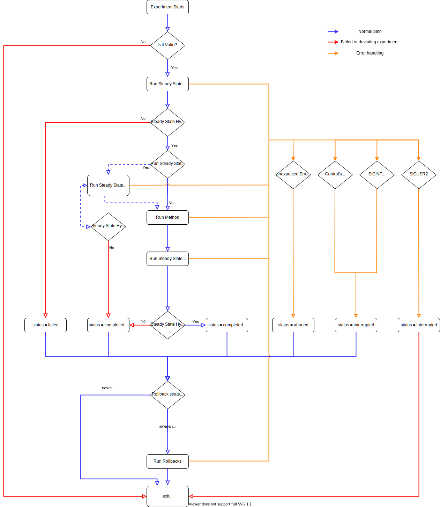

# Learn all about the experiment execution's flow

## Execution Flow Diagram

The diagram below shows the flow used by Chaos Toolkit when running
an experiment:

## What's happening when running an experiment?

Chaos Toolkit runs an experiment as given in the experiment's file. The
default behavior is straightforward, it runs the activities from the file
sequentially in the order they are declared.

The first block executed, if found, is the steady-state hypothesis block.
In this particular instances, it acts as a sort of a gateway to say "the system
is normal and meeting its baseline, you can carry on". By doing so, we notify
the world is in a state which we can comprehend and make sense of.

Then, the method is applied. Usually the method consists of at least an action
but can also contain probes and other actions. The first action defines the
turbulence we want to introduce into the system and see if it impacts our
initial baseline. Other actions should be few in numbers or they may render the
reading of the results challenging. Probes are merely data collectors of what
is happening in your system as the turbulence is happening. It helps the
analysis.

Next, the steady state hypothesis is executed again but, this time, it tells us
if our baseline has deviated considering the perturbation.

Finally, rollbacks are applied. They serve to usually undo the condition but
should not be misunderstood as a way to put the system back to a normal state
when the deviation really triggered a dire chain of events for your system.

## One experiment but a variety of execution strategies

Schematically, the execution flow runs the hypothesis, the method, the
hypothesis again and finally the rollbacks. However, this flow can somewhat
controlled via the Chaos Toolkit runtime flags.

### Hypothesis strategies

The default behavior is to execute the hypothesis before and after the method.
Unless, the hypothesis fails during the "before" phase. In that case, the
execution terminates as `"failed"` to signal the system wasn't in an
appropriate baseline state for the experiment to make sense.

The `chaos run` command provides the `--hypothesis-strategy` flag to change
the default behavior.

Sometimes, you have an experiment where you know the state is not appropriate
but you want to see if a specific condition could bring it back and make the
hypothesis valid after the method was applied. In that case, you should use
`--hypothesis-strategy=after-method-only`.

On the contrary, if you don't want to assert any deviation, you can decide
to run the hypothesis only before with
`--hypothesis-strategy=before-method-only`.

More interesting use cases can then be applied. What if you have a long
method and wish to not wait until it finishes to verify the hypothesis. Well,
then you can use ``--hypothesis-strategy=continuously` to indicate that, on
top of the default behavior, you want the hypothesis block to be applied
during the method periodically. You can change the period, which defaults to
every second, with `--hypothesis-frequency=10`. Notice that, in that case,
Chaos Toolkit will not interrupt as soon as a deviation is found. To do that,
you need to pass the additional `--fail-fast` flag.

Finally, you can also use `--hypothesis-strategy=during-method-only` to have
the same behavior as `continuously` but removing the default verification
before and after the method.

### Rollback strategies

Rollbacks are always executed save for three conditions:

* the hypothesis failed on its first pass. Before the method was applied.
  There is nothing to rollback in that case.
* the Chaos Toolkit received a signal such as SIGINT.
  Maybe the operator wants to investigate the system as it is.
* a control triggered an interruption

You may change that behavior with a `chaos run` flag.

Pass `--rollback-strategy=always` to apply rollbacks no matter the state of the
execution.

Use `--rollback-strategy=never` to never play them. This can be useful 
during authoring of the experiment sometimes.

Use `--rollback-strategy=deviated` to play rollbacks only if a deviation was
found.

## Terminating the execution gracefully

Chaos Engineering is a powerful practice that may lead to undesirable side
effects in your system. Sometimes, it is expected that an operator, or an
automated service, terminates an experiment much earlier to prevent
further difficulties.

### Let's start with the default behavior

When an experiment runs to its end it means that, even if a deviation was
found, the Chaos Toolkit should leave nothing hanging around, such as zombie
processes. Also, if rollbacks were declared and requested to be applied, they
will be played. In other words, if your experiment is properly constructed, 
you should not have to do anything else.

Chaos Toolkit makes no promises that your system will be back to its normal
however. The discovery you make along the way usually resolves in impacts
that cannot be anticipated.

This means that when an experiment finishes, your system may well be in a
very strange state but it does not mean Chaos Toolkit failed at doing its job.
In fact, it's quite the exact nature of the beast: Chaos Engineering is making
those pain points very clear to all.

Experiments can be interrupted. In that case, Chaos Toolkit tries its best
to abide by the runtime condition that you set. For instance, if you decided
to always play the rollbacks, Chaos Toolkit will execute them. The default
behavior is not to play them however for the simple reason that if you
interrupted an experiment, you may well want to investigate the system and if
rollbacks were executed, you may lose some important traces or state.

### Digging into the interruption's flow

When the Chaos Toolkit receives a signal, it starts the
termination flow of the experiment:

* When this happens during the first pass of
  the steady-state hypothesis block, this means the experiment finishes before
  its method is applied. In that case, rollbacks do not need to be played in any
  case.
* When the signal is caught during the method, remaining activities are not
  executed and the current running experiment is completed. Rollbacks are played
  if the strategy requested they are played. Otherwise, they are ignored.
  If an activity is running in the background, the experiment will wait until
  it finishes.
* When the signal is caught during the rollbacks, remaining actions are not
  played and the experiment finishes.

#### Reacting to signals, aka being a good citizen

The Chaos Toolkit knows it makes operators confident it will act appropriately
upon receiving a variety of [signals][]. It supports therefore the following
signals:

[signals]: https://en.wikipedia.org/wiki/Signal_(IPC)

* `SIGINT` 
  Mostly received when the operator hits Ctrl-C. This triggers the
  interruption flow.

* `SIGTERM`
  This signal is often used by other processes to indicate the Chaos Toolkit
  process ought to terminate. For instance, this is the signal sent to
  Kubernetes pods (with a graceful period before the harsher SIGKILL)

* `SIGUSR1`/`SIGUSR2` (Unix only)
  These two signals are rarely sent by operators but are used so that experiment
  extension author can programmatically terminate the experiment without
  having to wait for any blocking operation. 

In all cases, the termination flow is triggered. The only different one is
`SIGUSR2` which will always ignore rollbacks and will not wait for background
activities to terminate normally. In other words, `SIGUSR2` is the only way you
can terminate harshly an experiment.

Otherwise, there are no visible difference between `SIGINT`, `SIGTERM` and
`SIGUSR1`.

